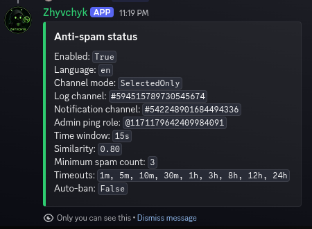
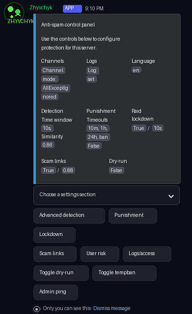
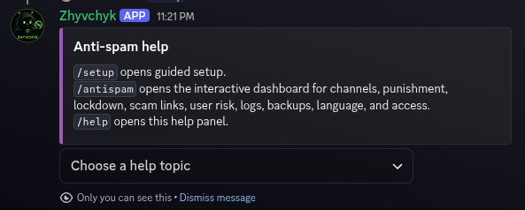

# Zhyvchyk Anti-Spam Bot

[](https://dotnet.microsoft.com/download/dotnet/8.0)
[](LICENSE)
[](docs/en/docker.md)
[](https://github.com/discord-net/Discord.Net)

Self-hosted Discord anti-spam and raid-protection bot built with C#, .NET 8, Discord.Net, dependency injection, JSON guild settings, and Discord-native setup menus.

Ukrainian documentation: [README.uk.md](README.uk.md)

## Features

- Multi-channel spam burst detection
- Similar message detection with normalization
- Emoji, punctuation, invisible character, and Unicode trick handling
- Scam link detection with blacklist, fuzzy domains, confusables, and leetspeak checks
- Repeated attachment and suspicious extension detection
- User risk scoring for new accounts and spam-after-join behavior
- Admin review reports with deleted-message quotes, image reuploads, and quick action buttons
- Immediate autoban for duplicate spam sent across several channels in a short window
- Temporary timeout/tempban escalation
- Raid lockdown with slowmode, optional channel lock, and restart recovery
- Anti-nuke audit-log monitoring
- Dry-run mode for safe testing
- Per-guild JSON settings, import/export, backups, and local moderation logs
- Interactive `/antispam` dashboard for non-technical server admins
- English and Ukrainian bot UI/localization

## Screenshots

| Configured server status | `/antispam` control panel | `/help` panel |
| --- | --- | --- |
|  |  |  |

## Quick Start

1. Install [.NET 8 SDK](https://dotnet.microsoft.com/download/dotnet/8.0).
2. Create a Discord application and bot in the Discord Developer Portal.
3. Enable privileged intents:
   - Server Members Intent
   - Message Content Intent
4. Invite the bot with:

```text
https://discord.com/oauth2/authorize?client_id=YOUR_CLIENT_ID&permissions=1101659187382&scope=bot%20applications.commands
```

5. Copy the example config:

```bash
cp appsettings.json.example appsettings.json
```

6. Put your token in `appsettings.json` or use an environment variable:

```bash
export ANTISPAM_Bot__Token="your-token-here"
```

7. Run the bot:

```bash
dotnet restore
dotnet run
```

8. In Discord, run `/setup` as the server owner or a Discord administrator.

## Docker

Create a `.env` file:

```bash
DISCORD_BOT_TOKEN=your-token-here
```

Run:

```bash
docker compose up -d --build
```

View logs:

```bash
docker compose logs -f
```

## Required Discord Permissions

The recommended permission integer is:

```text
1101659187382
```

It includes the permissions needed for message monitoring, message deletion, timeouts, tempbans, lockdown slowmode/channel locks, audit-log monitoring, slash commands, and moderation logs.

## Documentation

- [Setup Guide](docs/en/setup.md)
- [Docker Hosting](docs/en/docker.md)
- [VPS Hosting](docs/en/vps-hosting.md)
- [Configuration](docs/en/configuration.md)
- [Commands](docs/en/commands.md)
- [Features](docs/en/features.md)
- [Permissions](docs/en/permissions.md)
- [Troubleshooting](docs/en/troubleshooting.md)
- [Security](docs/en/security.md)
- [Roadmap](ROADMAP.md)
- [Contributing](CONTRIBUTING.md)

Ukrainian docs are available in [docs/uk](docs/uk).

## Legal

- [License](LICENSE)
- [Privacy Policy](PRIVACY.md)
- [Terms of Service](TERMS.md)
- [Security Policy](SECURITY.md)

## Important Security Notes

- Never commit `.env`, `appsettings.json`, `data/`, or moderation logs.
- If a token is leaked, reset it immediately in the Discord Developer Portal.
- Use dry-run mode before enabling strict punishments on a real server.
- This is a self-hosted project. You control the token, hosting, logs, and data.

## License

Copyright (c) 2026 SwEikil.

Released under the MIT License. See [LICENSE](LICENSE).
